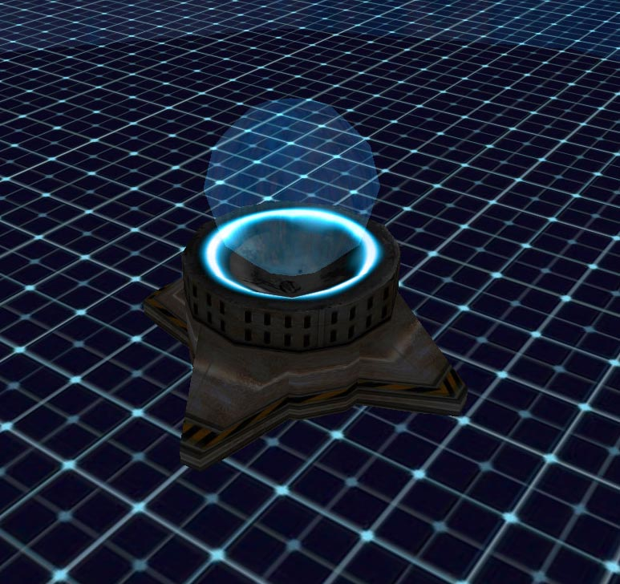

 
<h2 align="center">EDGE Modification for Tremulous GPP (1.2)</h2>

## Table of Contents
- [Introduction](#introduction)
- [Installation](#installation)
  - [Auto Install](#auto-install)
  - [Manual Build](#manual-build)
- [Features](#features)
  - [Gameplay](#gameplay)
  - [Human Faction](#human-faction)
    - [Buildings](#human-buildings)
    - [Weapons](#human-weapons)
    - [Equipment](#human-equipment)
  - [Alien Faction](#alien-faction)
    - [Buildings](#alien-buildings)
    - [Classes](#alien-classes)
  - [Maps](#maps)
- [Credits & License](#credits--license)
- [Acknowledgments](#acknowledgments)

## Introduction
Tremulous EDGE - Development Story </br>
In 2011, I decided to create a modified version of the open-source game [Tremulous](https://github.com/darklegion/tremulous). Previously, I had enjoyed playing an already modded version of this online game, but unfortunately, that particular mod was no longer being developed.
What started as a weekend project quickly evolved into a comprehensive modification that covered virtually every aspect of game development. New models, animations, sounds, textures, levels, menus, and code were created. However, my goal was always to pursue a specific game design vision without falling into feature creep. The objective was to expand the game significantly, particularly in base structure construction.
The focus was to create an extensive sci-fi framework around the two teams while addressing their design, behavior, and strengths. Humans, for example, are technology-based, featuring energy weapons, metal structures, and objects clearly of human origin. The strength of humans lies in technology and its strategic application.
Aliens, on the other hand, are primitive. They don't build with metal or stone - everything has an organic origin and grows naturally. Alien structures are immediately recognizable as such. The aliens' strength lies primarily in their speed of construction and movement. When played by skilled players, aliens are exceptionally powerful.
Their structures support them by enabling faster healing while dramatically altering the environment to create a camouflage effect that can be disorienting for humans. Everything hinted at in the base game was maximized with EDGE.
The name EDGE was chosen because the mod and its community were very small, existing only on the fringe - at the EDGE of the gaming landscape.

## Installation
This project is built for **Linux Ubuntu 64-bit**. A precompiled version is available for **Windows**.

### Auto Install
#### _Linux (Ubuntu 64-bit)_
##### Requirements
- Ubuntu 64-bit
- The following two `.zip` files must be downloaded **manually** and saved in your `Downloads` folder:
  - https://sourceforge.net/projects/tremulous/files/tremulous/1.1/tremulous-1.1.0.zip
  - https://sourceforge.net/projects/tremulous/files/tremulous/gpp/tremulous-gpp1.zip

##### 1. Preparation
Open a terminal and run the following steps:
```bash
cd ~/Downloads
git clone https://github.com/Masmblr/edge-mod.git
cd edge-mod
chmod +x *.sh
```

##### 2. Install
Run the installation script:
```bash
./install.sh
```
What `install.sh` does:
- Installs the following dependencies:
```bash
build-essential cmake git libsdl2-dev libopenal-dev libjpeg-dev libvorbis-dev zlib1g-dev libglew-dev libcurl4-openssl-dev libpng-dev libspeex-dev libogg-dev bison zip libsdl1.2-dev libsdl1.2debian lib32z1 lib32stdc++6
```
- Extracts and prepares the Tremulous-ZIP files
- Calls `build_project.sh` to compile the project
- Merges all files into a final structure under `~/Downloads/tremulous`

##### 3. Run Client or Server
To run the client via these scripts which are located in the tremulous folder:
```bash
./start_edge-client.sh
```
To run the server:
```bash
./start_edge-server.sh
```

#### _Windows 10_
##### 1. Preparation
- Download the following `.zip` files and save them in your `Downloads` folder:
  - https://sourceforge.net/projects/tremulous/files/tremulous/1.1/tremulous-1.1.0.zip
  - https://sourceforge.net/projects/tremulous/files/tremulous/gpp/tremulous-gpp1.zip
  - https://github.com/Masmblr/edge-mod/releases
  
- Extract all `.zip` files in one place.
- Place the edge-mod files into the tremulous folder.

##### 2. Start
Launch the client by running start_edge-client.bat, which is located in the tremulous folder.

### Manual Build _(Ubuntu 64-bit)_
If you want to compile later without reinstalling:
```bash
./build_project.sh
```

Files will be stored in edge-mod/build/*

## Features:

- **Comprehensive EDGE theme** - Light blue sci-fi visual overhaul
- **Enhanced HUD** - New visuals, scanner blips, info screens, and vote feedback
- **Redesigned menu system** - Includes comprehensive manual with server rules, commands, player levels and map voting
- **Data optimization** - Refactored game data for improved performance and reduced redundancy
- **Audio enhancement** - New sound effects and menu music
- **New Human Buildings [19]** → see [Human Buildings](#human-buildings)
- **New Human Weapons [6]** → see [Human Weapons](#human-weapons)
- **New Human Equipment [5]** → see [Human Equipment](#human-equipment)
- **New Alien Buildings [18]** → see [Alien Buildings](#alien-buildings)
- **New Alien Classes [5]** → see [Alien Classes](#alien-classes)
- **Armageddon command** - Provides credits/evos to both teams to restart stalled matches
- **Build point system** - Implemented Creep Colony/Refinery system providing balanced build points per structure using iltavuo's models
- **Team balancing** - Integrated CU|ams' code for automatic team distribution
- **Advanced gameplay features** - Includes TremX's Advanced Dretch and Biokit
- **Killer HP display** - Shows killer health information
- **Vote sound** - Audio notification for active voting sessions
- **Console commands** - New commands added with theme-integrated styling
- **Code improvements** - Additional modifications, fixes, refactoring, cleanup and optimizations

## Human Buildings


| Name | BP | Stage | Health | Dmg | Build Limit | Requires Energy? | Ability / Notes |
|------|:--:|:-----:|:------:|:------:|:-----------:|:----------------:|-----------------|
| Container (S) | 1 | 1 | 60 | – | ~ | No | Provides basic protection. Stackable; can be used as stairs when combined with other containers.  |
| Container (M) | 2 | 2 | 250 | – | ~ | No | *  |
| Container (L) | 5 | 3 | 450 | – | ~ | No | *   |
| Plate (S) | 1 | 1 | 25 | – | ~ | No | Used to build bridges or roofs.  |
| Plate (L) | 3 | 3 | 100 | – | ~ | No | *  |
| Fence | 3 | 2 | 100 | – | ~ | No | –  |
| Fence Rod | 2 | 2 | 50 | – | ~ | No | –  |
| Barrier (Line) | 2 | 1 | 300 | – | ~ | No | Effective for slowing down large aliens.  |
| Barrier (Corner) | 2 | 2 | 300 | – | ~ | No | –  |
| Barrier (Point) | 3 | 2 | 350 | – | ~ | No | –  |
| Shield | 8 | 3 | 600 | – | ~ | Yes | Gate that opens for humans on contact, closes afterward; works only for humans.   |
| Flame Turret | 14 | 2 | 300 | 16 | ~ | Yes | Fires a trail of flames; close-range defense.   |
| Ammo Supply | 5 | 2 | 155 | – | ~ | No | Refills non-energy weapons on contact; does not require a powered zone.  |
| Teflon Foil | 1 | 1 | 50 | – | ~ | No | Camouflages human buildings.  |
| Barrel | 1 | 1 | 250 | – | ~ | No | –  |
| Force Field | 150 | 3 | 200 | – | ~ | Yes | Pushes nearby aliens away, creating a defensive zone.    |
| Cover Stump | 15 | 3 | 650 | – | ~ | No | A stump that can be combined with cover.  |
| Cover | 20 | 3 | 850 | – | ~ | No | Cover, used on top of a stump to form a dome-like structure.   |
| Refinery | 5 | 2 | 350 | – | ~ | Yes | Provides extra build points; cannot be stacked in the same area.  |

## Human Weapons

| Name | Price | Stage | Clips | Ammo | Dmg | Ability / Notes |
|------|:-----:|:-----:|:-----:|:----:|:------:|-----------------|
| Adv. Pain Saw | 100 | 1 | ~ | ~ | 11 | Primary: saw attack; Secondary: saw-blade shot  |
| Adv. Machine Gun | 0 | 1 | 5 | 35 | 5 | Primary: normal fire; Secondary: very fast fire burst  |
| Adv. Pulse Rifle | 450 | 2 | 5 | 40 (+20) | 9 | Primary: fast fire; Secondary: slow fire; with battery: +20 shots  |
| Adv. Chaingun | 400 | 1 | 0 | 350 | 3, 6 | Primary: fast fire; Secondary: slow fire / more damage per bullet  |
| Adv. Flamethrower | 550 | 2 | 1 | 150 (Gas) | 20 | Primary: flamethrower; Secondary: charged napalm shot, spawns fires  |
| Adv. Massdriver | 350 | 1 | 4 | 3 (+2) | 40, 80 | Primary: mass shot; Secondary: plasma-homing projectile; with battery: +2 shots </br>  |

## Human Equipment

| Name | Price | Stage | Damage | Stamina-rate | Healrate | Ability / Notes |
|------|:-----:|:-----:|:------:|:------------:|:--------:|-----------------|
| Biokit  | 200 | 2 | – | x2 | x2 | Grants poison and infection protection, heals faster; activated by default |
| Cloak Device   | 150 | 2 | – | – | – | Renders user invisible for 40s; backpack and jetpack remain visible  |
| Mine  | 650 | 3 | 350 | – | – | Powerful mine, sticks to any surface, triggered by touching alien players </br>   |
| Smoke Grenade  | 250 | 1 | 1 | – | – | Emits a smoke particle system for ~15s - 20s  |
| Adv. Grenade | 200 | 2 | 250 | – | – | Emits smoke and flames using improved particle system  |

## Alien Buildings


| Name | BP | Stage | Health | Dmg | Buildlimit | Need Creep? | Ability / Notes |
|------|:--:|:-----:|:------:|:------:|:----------:|:-----------:|-----------------|
| Panzer (S) | 1 | 1 | 100 | – | ~ | No | Used to provide some base protection  |
| Panzer (M) | 2 | 2 | 250 | – | ~ | No | *  |
| Panzer (L) | 5 | 3 | 450 | – | ~ | No | *  |
| Tendon (S) | 1 | 1 | 25 | – | ~ | No | Used to build bridges or roofs  |
| Tendon (M) | 2 | 2 | 50 | – | ~ | No | *  |
| Tendon (L) | 3 | 3 | 100 | – | ~ | No | *  |
| Net | 3 | 2 | 80 | – | ~ | No | –  |
| Net Spike | 2 | 1 | 50 | – | ~ | No | –  |
| Infestation Slime | 15 | 2 | 250 | 8 | ~ | Yes | Pulls in enemies, damages over time. Radius: 130   |
| Infestation Thicket | 4 | 1 | 250 | – | ~ | Yes | Infestation in vertical direction  |
| Infestation Blister | 3 | 2 | 250 | – | ~ | Yes | Large infestation area - spawns a giant creep  |
| | | | | | | | *Infestation objects are meant to cover the environment with alien structures to enhance immersion and provide a camouflage advantage. |
| Reflector | 3 | 3 | 250 | – | ~ | Yes | Reflects human energy weapons   |
| Muscle | 3 | 2 | 100 | – | ~ | Yes | Pushes players upward by 600 units  |
| Spiteful Abscess | 3 | 2 | 60 | 52 | ~ | Yes | Explodes on human touch into poisonous/acid gas, causes visual distortion </br>  |
| Cocoon | 35 | 3 | 250 | – | 1 | Yes | Heals alien players faster than Booster; regenerates Advanced Dragoon barbs more quickly  |
| Organic Bulb | 3 | 2 | 35 | – | ~ | Yes | Emits direct light to illuminate surroundings  |
| Pod | 20 | 3 | 850 | – | ~ | No | Must be placed on a Pod Stump; shelters alien structures   |
| Pod Stump | – | 3 | – | – | ~ | No | Support structure to carry a Pod  |
| Creep Colony | 15 | 2 | 650 | – | ~ | Yes | Grants extra build points (BP), not stackable within range  |

## Alien Classes

| Name | Evo Cost | Stage | Health | Ammo | Dmg | Ability / Notes |
|------|:--------:|:-----:|:------:|:----:|:------:|-----------------|
| Adv. Dretch | 1 | 1 | 40 | 0 | 45 | Can pounce, spread infections and attack defensive buildings |
| Adv. Basilisk | 1 | 2 | 80 | 1 | 32/50</br>+200 splash | It can become invisible if standing still, has full health and Overmind is alive, in addition to that it has an acid bomb that is similar to a grenade and regenerates |
| Adv. Marauder | 2 | 2 | 175 | 3 | 45 | Has the ability to snipe 3 barbs |
| Hummel | 4 | 2 | 200 | 10 (prickles) | 40/40/3 | Fast airborne unit, has claw- air-pounce attack and can shoot small projectiles  |
| Tyrant | 2 | 3 | 400 | 3 | 60(claw)</br>/45(trample)</br>/100(crush)</br>/80(breath) | Has the ability to shoot 3 fire breaths and has +100hp  |

## Maps
During the active EDGE period, I created numerous maps for the project. Below is a complete list with names and links to the sources and binaries:

- [ATCS 2015](https://github.com/Masmblr/map-atcs_2015_src)
- [ATCS YE](https://github.com/Masmblr/map-atcsye_src)
- [BaseRace](https://github.com/Masmblr/map-baserace_src)
- [EDGE One](https://github.com/Masmblr/map-edge_one_src)
- [Gloom4](https://github.com/Masmblr/map-gloom4_src)
- [Mission EDGE](https://github.com/Masmblr/map-mission_edge_src)
- [Narrow EDGE](https://github.com/Masmblr/map-narrow_edge_src)
- [SM64](https://github.com/Masmblr/map-sm64_src)
- [Satan](https://github.com/Masmblr/map-satan_src)
- [Zelda World](https://github.com/Masmblr/map-zeldaworld_src)

## Credits & License
- © 1999 - 2005 id Software
- © 2006 - 2009 Darklegion Development
- © 2009 TremX (Advanced Dretch & BioKit)
- © 2013 mtiusane (Team Balance Code)
- © 2013 iltavuo (Creep Colony, Refinery & AcidBomb models)
- © 2013 - 2025 Masmblr (EDGE-Modification)

A comprehensive list of all files and their respective licenses can be found in the following document:
[→ Overview.txt](./docs/copyright/Overview.txt)

## Acknowledgments
Special thanks to The_ThinG, Raptor, Ghost, Mario, mtiusane, space-marine, ppnl, and iltavuo for your invaluable support and contributions to this project.
To anyone I may have missed - thank you as well. I'm grateful to have had all of you on this journey.
Thank you for being there!
